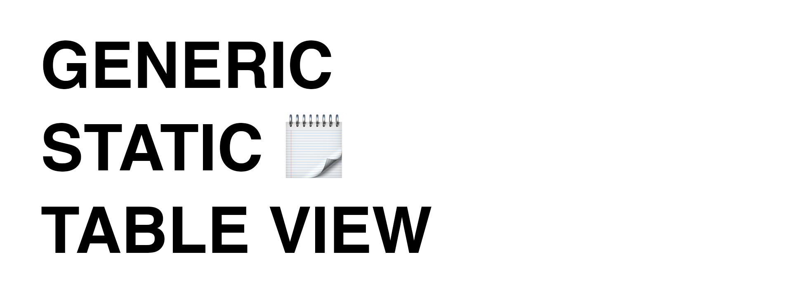

# Демо проект статических Generic таблиц

Всем нам часто приходится сталкиваться со статическими таблицами, они могут являться настройками нашего приложения, экранами авторизации, экранами «о нас» и многими другими. Но часто начинающие разработчики не применяют никакие паттерны разработки подобных таблиц и пишут все в одном классе немасштабируемую, негибкую систему. 

Статья о паттерне на Habr: https://habr.com/ru/post/439016/
